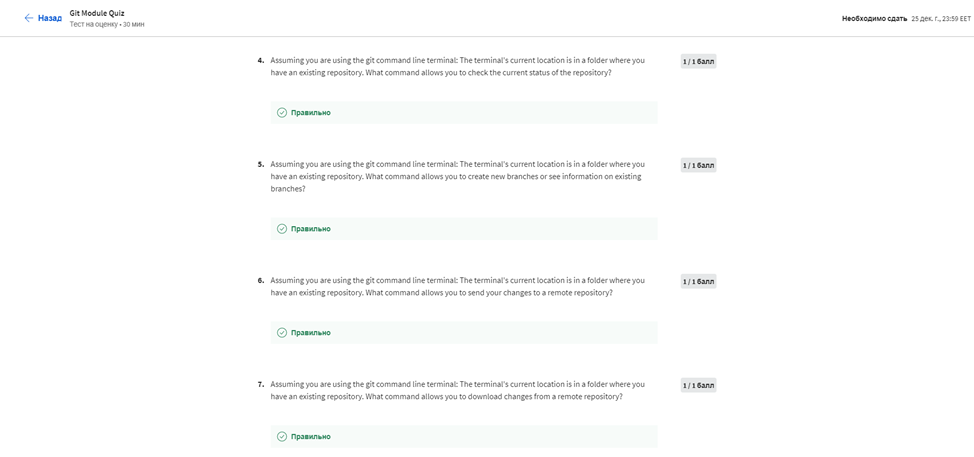
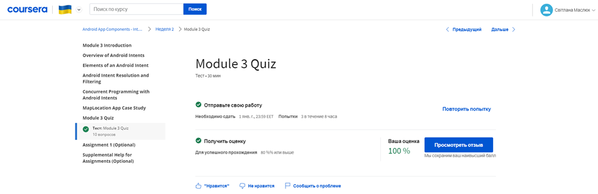

# МІНІСТЕРСТВО ОСВІТИ І НАУКИ УКРАЇНИ

### ХАРКІВСКИЙ НАЦІОНАЛЬНИЙ ЕКОНОМІЧНИЙ УНІВЕРСИТЕТ ІМЕНИ СЕМЕНА КУЗНЕЦЯ

### КАФЕДРА ІНФОРМАЦІЙНИХ СИСТЕМ

#### ЗВІТ

з проходження курсу «Android App Development» 1-2 тиждень

з дисципліни «Програмування для мобільних пристроїв»

Виконав:
студентка 4 курсу
групи  6.04.122.010.19.1
факультету ІТ
Маcлюк Світлана

Перевірив
доц. Поляков А.О.

Харків – 2022

#### Мета роботи
 

#### Хід роботи

#### Хід роботи
>Тиждень 1

Було виконанно Module 1 Quiz:
>
>
>
>
>
>
>
>
Результат:
>

> Тиждень 2

Було виконанно Git Module Quiz:

>
>

Результат:
>

>Тиждень 3

Було виконанно Module 3 Quiz:
>
>
>
>
>
>
>
>
>
>

Результат:
>

Сертефікат:
>
>
>
#### Висновок
На даному курсі ми дізнатися, чому Spring Framework є одним із домінуючих фреймворків розробки Java. 