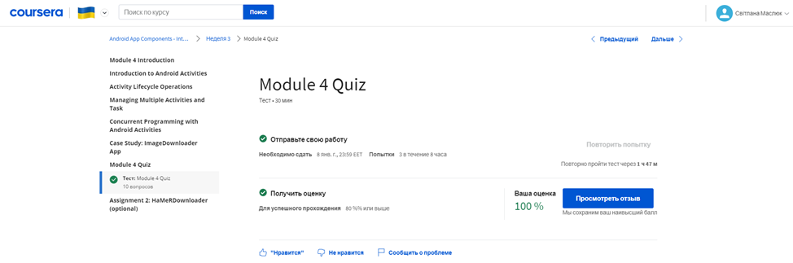
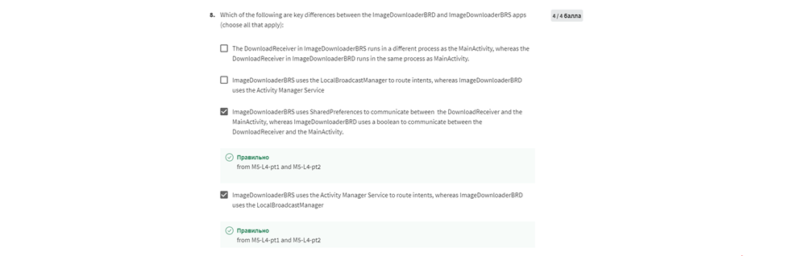

# МІНІСТЕРСТВО ОСВІТИ І НАУКИ УКРАЇНИ

### ХАРКІВСКИЙ НАЦІОНАЛЬНИЙ ЕКОНОМІЧНИЙ УНІВЕРСИТЕТ ІМЕНИ СЕМЕНА КУЗНЕЦЯ

### КАФЕДРА ІНФОРМАЦІЙНИХ СИСТЕМ

#### ЗВІТ

з проходження курсу Android App Components - Intents, Activities and Broad cast Receivers» 3-4 тиждень

з дисципліни «Програмування для мобільних пристроїв»

Виконав:
студентка 4 курсу
групи  6.04.122.010.19.1
факультету ІТ
Маcлюк Світлана

Перевірив
доц. Поляков А.О.

Харків – 2022

#### Мета роботи
Заглиблюючись у основні компоненти додатків Android, такі як наміри, дії та приймачі широкомовлення.

#### Хід роботи
Цей 4-тижневий MOOC спирається на огляд Java та Android, розглянутий у курсі 1, заглиблюючись у основні компоненти додатків Android, такі як наміри, дії та приймачі широкомовлення. На прикладі ви дізнаєтесь, як запрограмувати ці основні компоненти Android разом із фреймворками паралелізму Android і базовими класами файлового введення/виведення Java (такими як File та InputStream) і механізмами зберігання Android (такими як Shared Preferences). Ви також дізнаєтеся, як використовувати систему керування вихідним кодом Git. Протягом цього MOOC ви будете поступово працювати над проектом, який передбачає завантаження, зберігання та відображення зображень із віддалених веб-сайтів. Щотижня ви додаватимете додаткові можливості до проекту на основі матеріалів, висвітлених у відео лекціях. Ви витрачатимете приблизно 4 години на тиждень на перегляд відеолекцій, відповіді на тести та виконання завдань з програмування на Java та Android.

#### Хід роботи

>Тиждень 3

Android Activities
Цей модуль описує структуру, функціональні можливості та використання дій Android, які визначають дії користувача, які відображаються на екрані пристрою. Діяльність є найпоширенішим типом компонента Android і є основою додатків Android.

Було виконанно Module 4 Quiz:
>
>
>

Результат:
>

> Тиждень 4
 
Android Broadcast Receivers

Було виконанно Module 5 Quiz:
>
>
>
>
>
>

Результат:
>

Сертефікат:
>
>
>

#### Висновок
Розглянули основны компоненти додатків для Android і платформах паралелізму,
розглянутих у курсі 2, зосереджуючись на запущених і пов’язаних службах,
локальному міжпроцесному зв’язку (IPC) і постачальниках контенту.