# МІНІСТЕРСТВО ОСВІТИ І НАУКИ УКРАЇНИ

### ХАРКІВСКИЙ НАЦІОНАЛЬНИЙ ЕКОНОМІЧНИЙ УНІВЕРСИТЕТ ІМЕНИ СЕМЕНА КУЗНЕЦЯ

### КАФЕДРА ІНФОРМАЦІЙНИХ СИСТЕМ

#### ЗВІТ

з проходження курсу «Android App Components - Services, Local IPC, and Content Providers» 1-2 тиждень

з дисципліни «Програмування для мобільних пристроїв»

Виконав:
студент 4 курсу
групи  6.04.122.010.19.1
факультету ІТ
Маcлюк Світлана

Перевірив
доц. Поляков А.О.

Харків – 2022

#### Мета роботи
Розглянути основних компонентах додатків для Android і платформах паралелізму, 
розглянутих у курсі 2, зосереджуючись на запущених і пов’язаних службах, 
локальному міжпроцесному зв’язку (IPC) і постачальниках контенту.

#### Хід роботи
Цей 4-тижневий MOOC базується на основних компонентах додатків для Android і платформах паралелізму,
розглянутих у курсі 2, зосереджуючись на запущених і пов’язаних службах, 
локальному міжпроцесному зв’язку (IPC) і постачальниках контенту. 
Додатки для прикладів розглядатимуться з різних точок зору, 
щоб навчитися програмувати ці компоненти додатків за допомогою парадигми матеріального дизайну Android. 
Студенти поступово працюватимуть над практичним проектом із застосуванням програми для читання RSS 
на основі матеріального дизайну. Щотижня ви додаватимете додаткові можливості до проекту на основі матеріалів,
висвітлених у відео лекціях. Ви витрачатимете приблизно 4 години на тиждень на перегляд відеолекцій,
відповіді на тести та виконання завдань з програмування на Java та Android.

#### Хід роботи

>Тиждень 1

Огляд MOOC
Цей модуль містить вступ до змісту MOOC і підсумовує ефективні стратегії навчання. Цілі навчання представлені у відеолекції «Вступ до модуля».

Було виконанно Module 1 Quiz:
>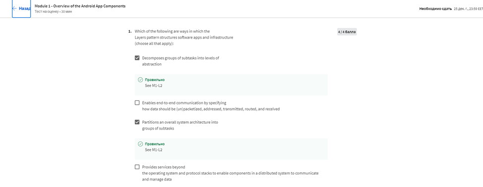
>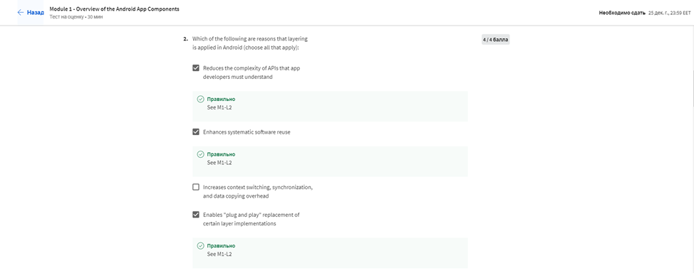
>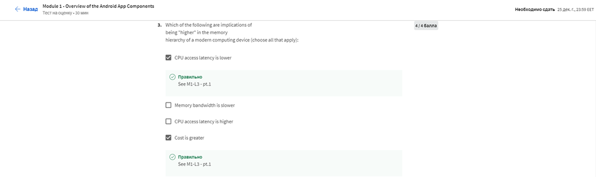
>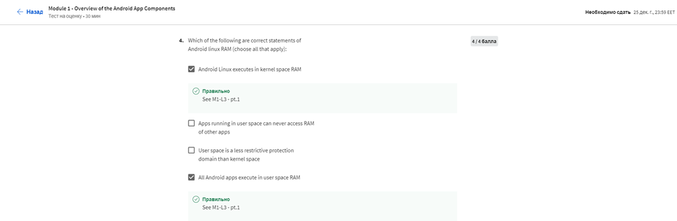
>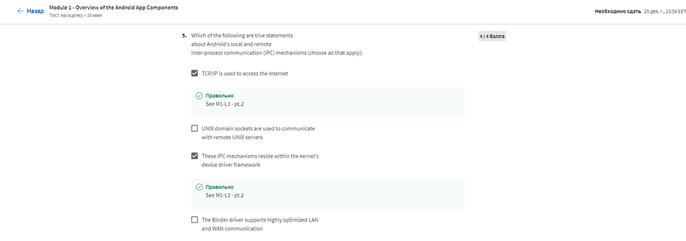
>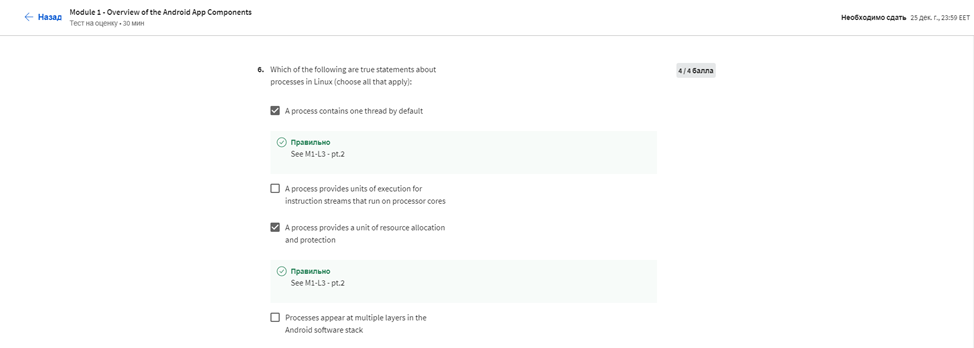
>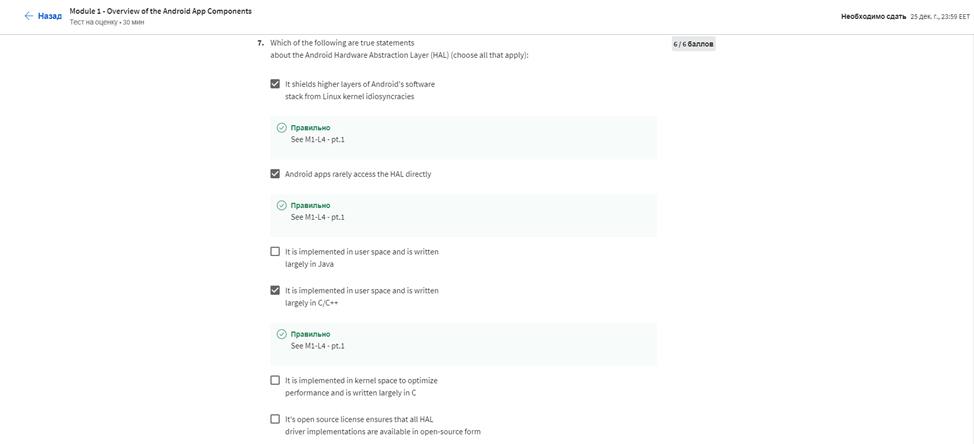
>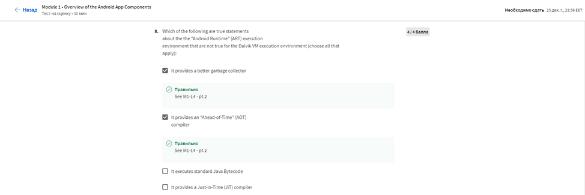
>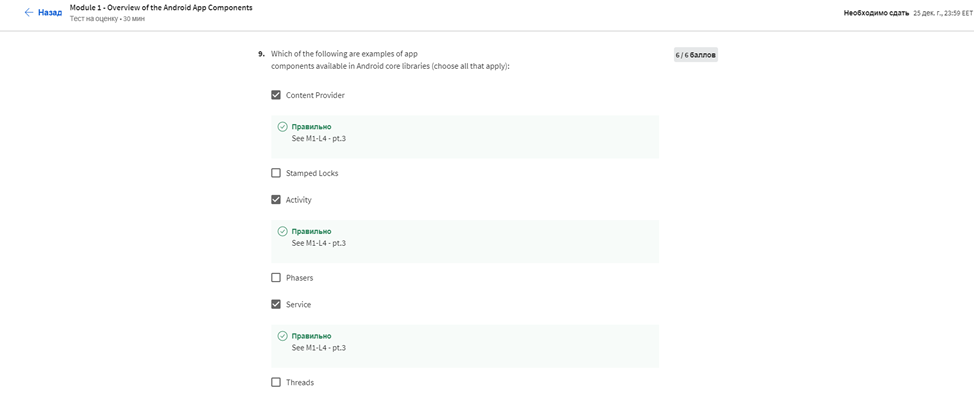
>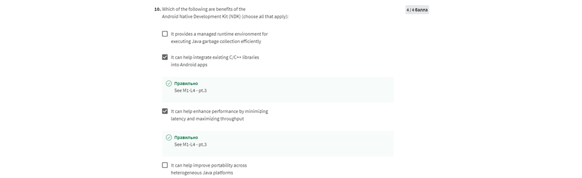

Результат:
>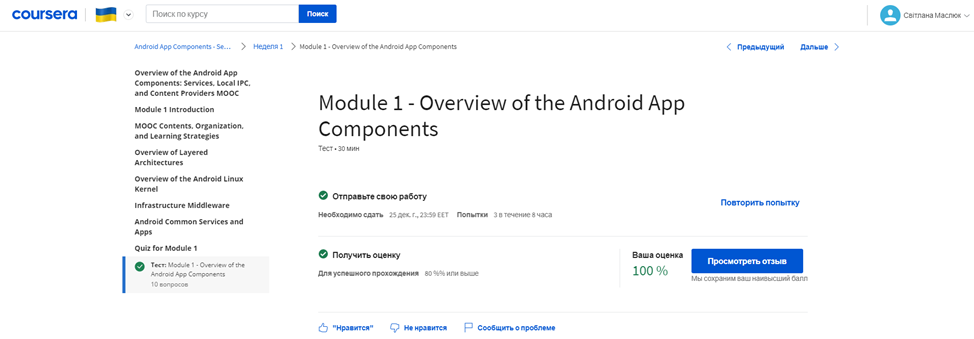

> Тиждень 2

Android Started and Bound Services
Learning objectives are presented in the Module Introduction video lecture.

Було виконанно Module 2 Quiz:
>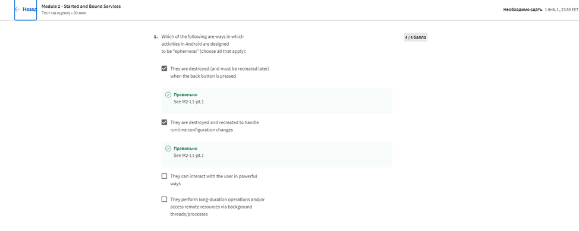
>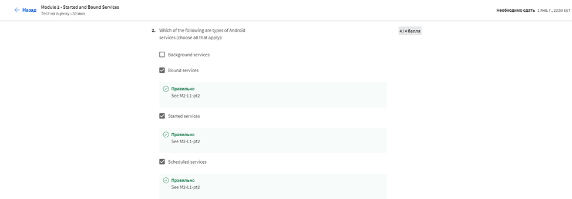
>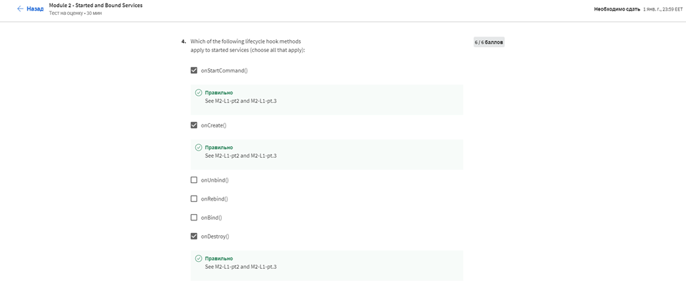
>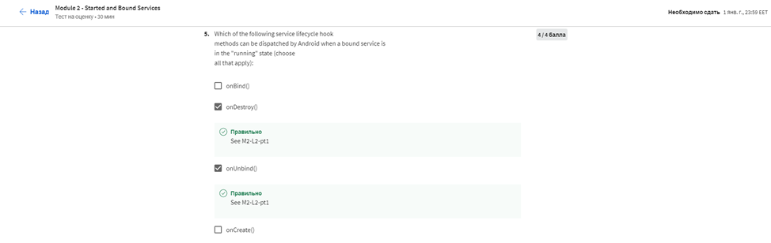
>
>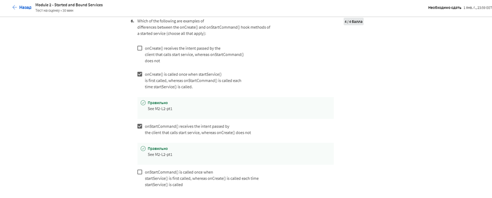
>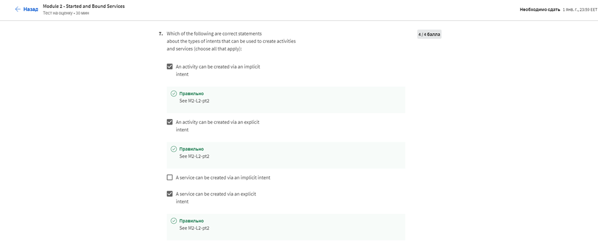
>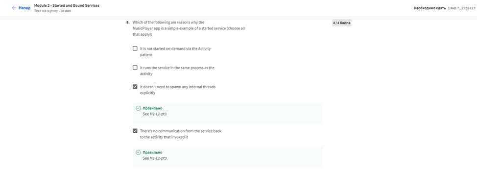
>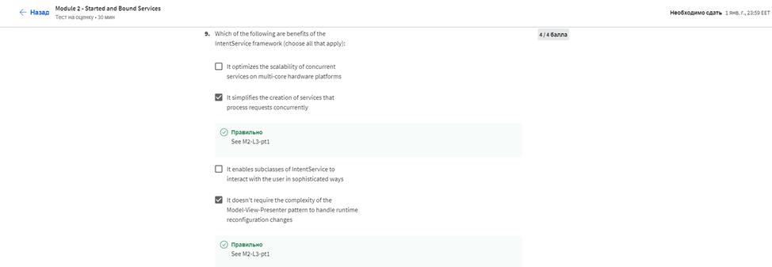
>
Результат:
>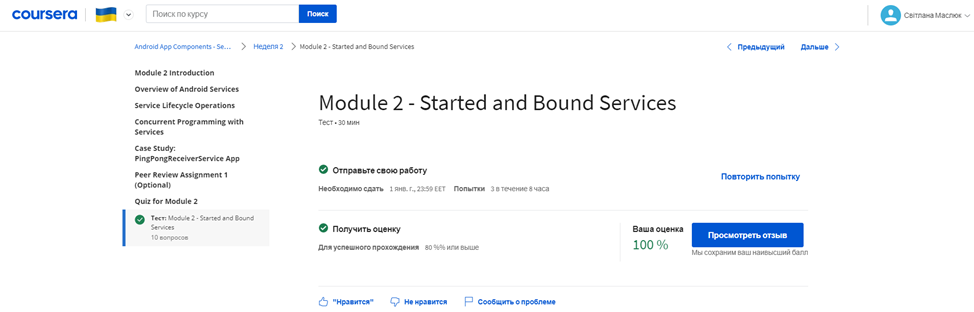

Сертефікат:
>
>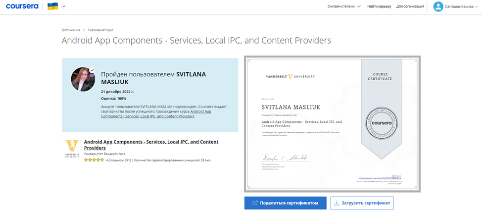
>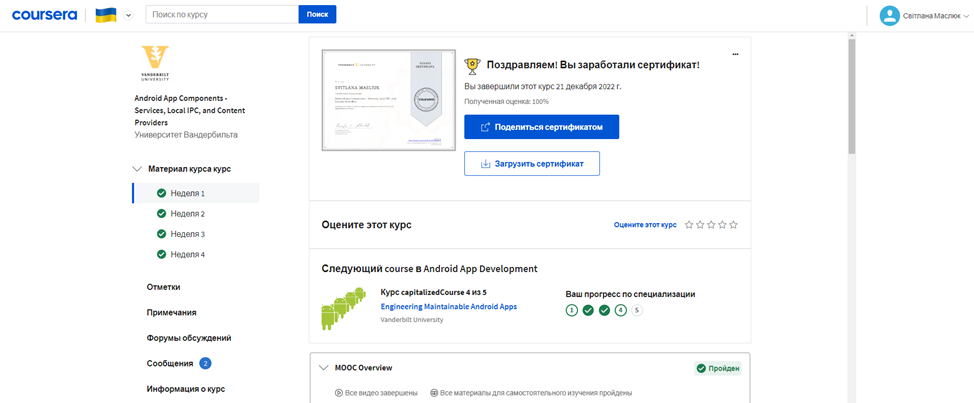

#### Висновок
Розглянули основны компоненти додатків для Android і платформах паралелізму,
розглянутих у курсі 2, зосереджуючись на запущених і пов’язаних службах,
локальному міжпроцесному зв’язку (IPC) і постачальниках контенту.