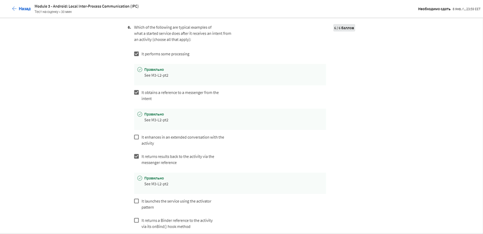
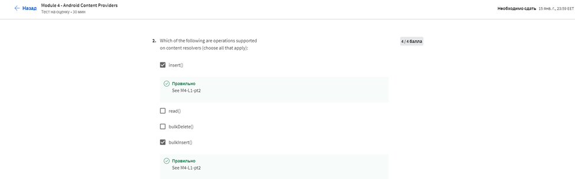

# МІНІСТЕРСТВО ОСВІТИ І НАУКИ УКРАЇНИ

### ХАРКІВСКИЙ НАЦІОНАЛЬНИЙ ЕКОНОМІЧНИЙ УНІВЕРСИТЕТ ІМЕНИ СЕМЕНА КУЗНЕЦЯ

### КАФЕДРА ІНФОРМАЦІЙНИХ СИСТЕМ

#### ЗВІТ

з проходження курсу «Android Add Development» 3-4 тиждень

з дисципліни «Android Add Development - Intents, Activities, and Broadcast Receiver»

Виконав:
студент 4 курсу
групи  6.04.122.010.19.1
факультету ІТ
Маcлюк Світлана

Перевірив
доц. Поляков А.О.

Харків – 2022

#### Мета роботи

#### Хід роботи

#### Хід роботи
>Тиждень 3

Було виконанно Module 3 Quiz:
>
>
>
>
>
>
>
>
>
>

Результат:
>

> Тиждень 3

Було виконанно Module 4 Quiz:
>
>
>
>
>
>
>
>
>
>

Результат:
>

Сертефікат:
>
>
>

#### Висновок
