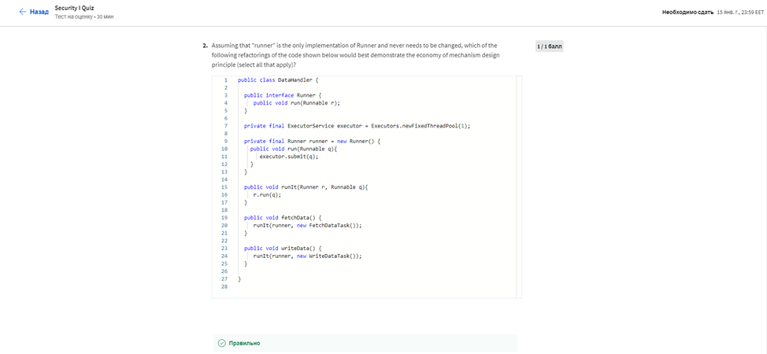
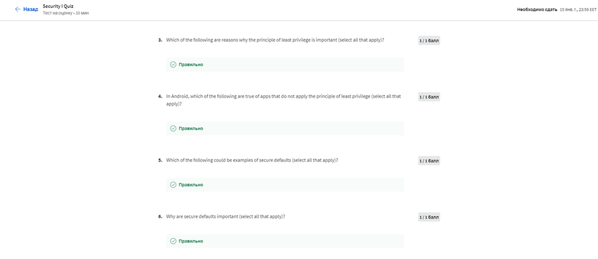
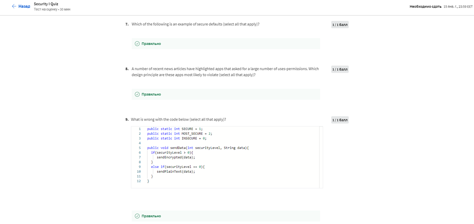
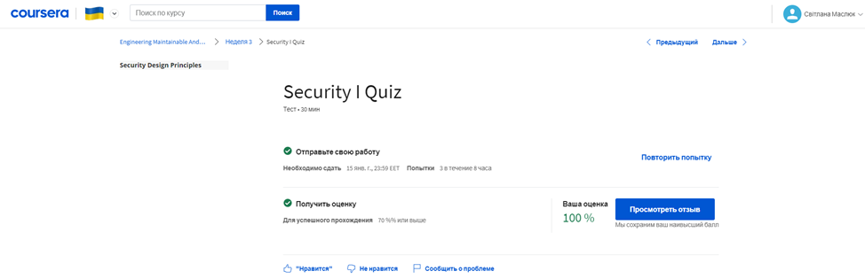
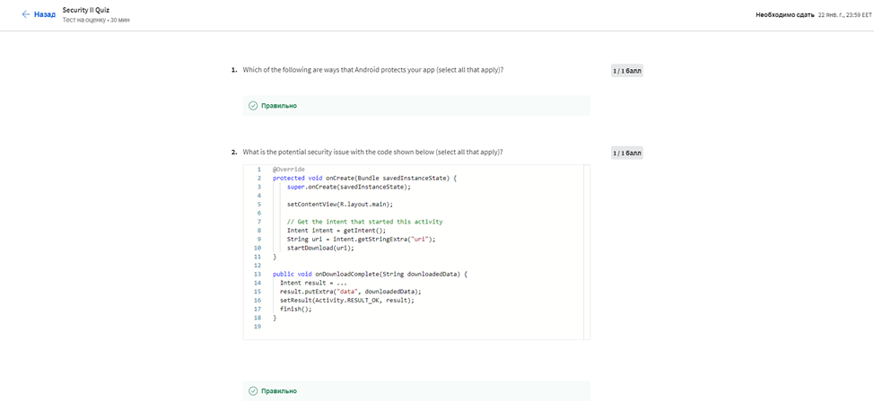
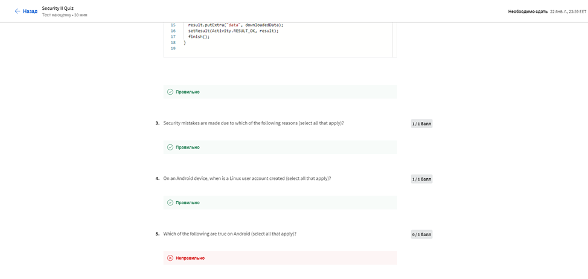

# МІНІСТЕРСТВО ОСВІТИ І НАУКИ УКРАЇНИ

### ХАРКІВСКИЙ НАЦІОНАЛЬНИЙ ЕКОНОМІЧНИЙ УНІВЕРСИТЕТ ІМЕНИ СЕМЕНА КУЗНЕЦЯ

### КАФЕДРА ІНФОРМАЦІЙНИХ СИСТЕМ

#### ЗВІТ

з проходження курсу «Engineering Maintainable Android Apps» 3-4 тиждень

з дисципліни «Програмування для мобільних пристроїв»

Виконав:
студент 4 курсу
групи  6.04.122.010.19.1
факультету ІТ
Маcлюк Світлана

Перевірив
доц. Поляков А.О.

Харків – 2022

#### Мета роботи
Опрацювати приклади та різні методи розробки підтримуваних програм Android, включаючи методи розробки, керовані тестуванням, і те, як розробляти/запускати модульні тести за допомогою JUnit і Robotium (або еквівалентних автоматизованих систем тестування для Android)

#### Хід роботи
Engineering Maintainable Android Apps, який є 4-тижневим MOOC, який демонструє на прикладах різні методи розробки підтримуваних програм Android, включаючи методи розробки, керовані тестуванням, і те, як розробляти/запускати модульні тести за допомогою JUnit і Robotium (або еквівалентних автоматизованих систем тестування для Android) , а також як успішно застосовувати загальні шаблони програмного забезпечення Java/Android для покращення розширюваності та чіткості програм Android. Студенти працюватимуть над відповідними автоматизованими тестами на основі матеріалу, висвітленого у відео лекціях. Ці уроки продемонструють переваги належної практики розробки програмного забезпечення, яка спрямована на створення придатного для обслуговування коду для мобільних програм.

Буде приблизно 3-4 години залучення студентів на тиждень, включаючи відеолекції та вікторини. Порядок модулів у курсі розроблений таким чином, щоб бути гнучким. Зокрема, студенти можуть переглядати відео в будь-якому порядку, який відповідає їхньому досвіду та потребам, наприклад, вони можуть захотіти переглянути відео про модульне тестування перед відео про шаблони програмного забезпечення, якщо вони бажають спочатку дізнатися про модульне тестування.

#### Хід роботи

>Тиждень 3

Security & Sustainability I

Було виконанно Module 3 Quiz:
>
>
>
>
>

Результат:
>

> Тиждень 4

Було виконанно Module 4 Quiz:

Безпека та стабільність II
Цей модуль містить введення в модульне тестування за допомогою Junit 4.0 Framework в Android, а також ознайомлення з тестовими платформами з використанням тестової інфраструктури Robotium з відкритим вихідним кодом для написання випадків тестування сірого ящика для автоматизації тестування багатофункціональних програм Android.

>
>

Результат:
>

Сертефікат:
>
>
>

#### Висновок
Опрацювала приклади та різні методи розробки підтримуваних програм Android, включаючи методи розробки, керовані тестуванням, і те, як розробляти/запускати модульні тести за допомогою JUnit і Robotium (або еквівалентних автоматизованих систем тестування для Android)
