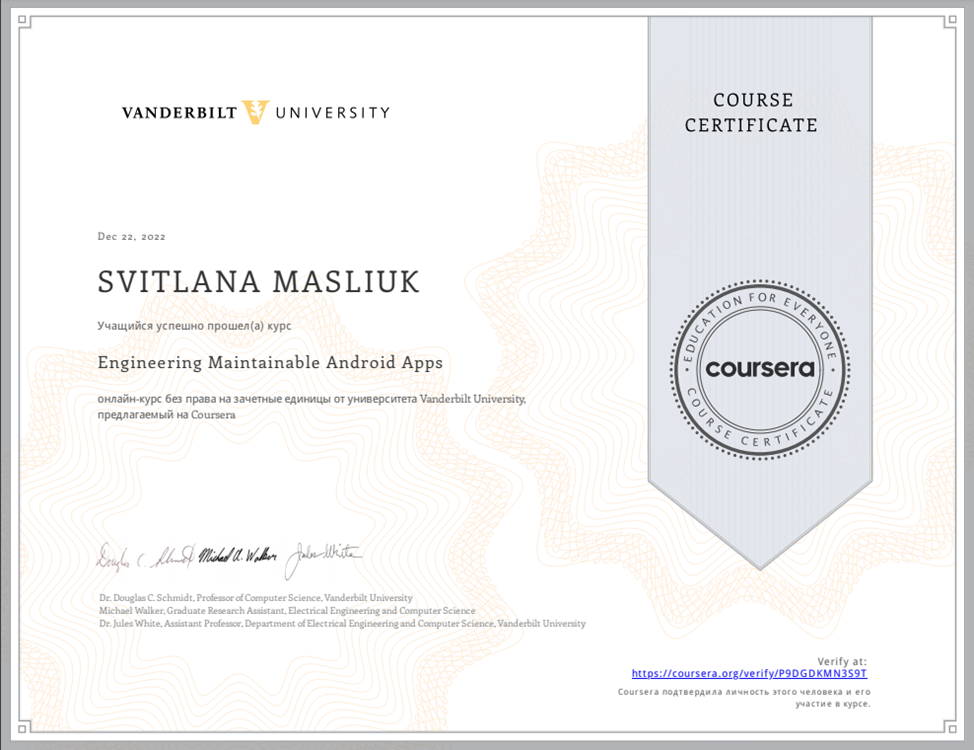
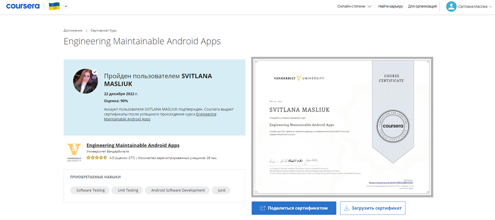
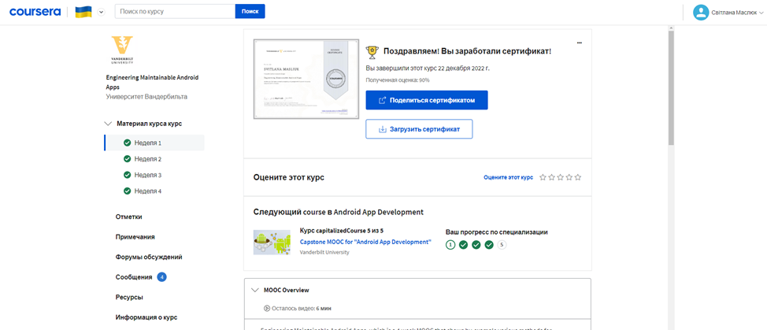

# МІНІСТЕРСТВО ОСВІТИ І НАУКИ УКРАЇНИ

### ХАРКІВСКИЙ НАЦІОНАЛЬНИЙ ЕКОНОМІЧНИЙ УНІВЕРСИТЕТ ІМЕНИ СЕМЕНА КУЗНЕЦЯ

### КАФЕДРА ІНФОРМАЦІЙНИХ СИСТЕМ

#### ЗВІТ

з проходження курсу «» 3-4 тиждень

з дисципліни «Програмування для мобільних пристроїв»

Виконав:
студент 4 курсу
групи  6.04.122.010.19.1
факультету ІТ
Маcлюк Світлана

Перевірив
доц. Поляков А.О.

Харків – 2022

#### Мета роботи

#### Репозиторій
[Посилання на репозиторій](https://github.com/MaslyukSveta/MJT/tree/master/SpringCloudOverview)

#### Хід роботи

#### Хід роботи
>Тиждень 3

Було виконанно Module 3 Quiz:
>
>
>
>
>
>
>

Результат:
>

> Тиждень 4

Було виконанно Module 4 Quiz:
>
>
>
>
>

Результат:
>

Сертефікат:
>
>
>
#### Висновок
