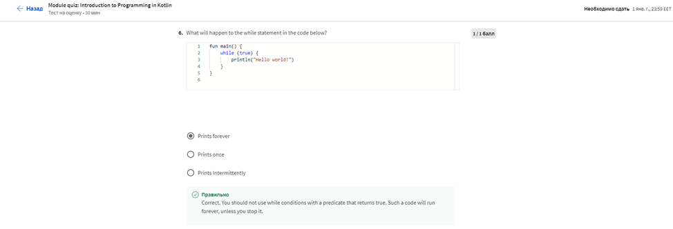

# МІНІСТЕРСТВО ОСВІТИ І НАУКИ УКРАЇНИ

### ХАРКІВСКИЙ НАЦІОНАЛЬНИЙ ЕКОНОМІЧНИЙ УНІВЕРСИТЕТ ІМЕНИ СЕМЕНА КУЗНЕЦЯ

### КАФЕДРА ІНФОРМАЦІЙНИХ СИСТЕМ

#### ЗВІТ

з проходження курсу «Programing Fundamentals in Kotlin» 1-2 тиждень

з дисципліни «Програмування для мобільних пристроїв»

Виконав:
студентка 4 курсу
групи  6.04.122.010.19.1
факультету ІТ
Маcлюк Світлана

Перевірив
доц. Поляков А.О.

Харків – 2022

#### Мета роботи
Розширити свої знання основи програмування, які є основою будь-якої мови, а також унікальні аспекти синтаксису Kotlin.

#### Хід роботи
Практикуйте та розширюйте основи програмування, які є основою будь-якої мови, а також унікальні аспекти синтаксису Kotlin. Ви працюватимете з типами даних, функціями, умовними операторами, колекціями-масивами, змінними та циклами.

Крім того, ви будете оголошувати та ініціалізувати різні типи змінних і пояснювати їх область дії, а також створювати масиви та колекції в Kotlin. Ви створите шаблони потоку керування, використовуючи умови та цикли. Буде можливість попрактикуватися у використанні структур і класів, розглядаючи найкращі випадки для обох. Відкрийте для себе глибші способи використання об’єктів у Kotlin через дослідження інтерфейсів і класів.

Після завершення цього курсу ви зможете:

• Опишіть основні типи та змінні
• Поясніть числа в Kotlin
• Поясніть, що таке умови
• Опишіть, як використовувати петлі
• Поясніть поняття функції
• Розрізняти параметр і аргумент
• Поясніть, що функція може повертати значення, і опишіть, як це працює
• Поясніть різницю між класом, об'єктом і типом
• Розрізняти різні модифікатори видимості
• Опишіть використання колекцій у програмуванні
• Визначте, який тип колекції використовувати в тій чи іншій ситуації
• Поясніть різницю між List, Set і Map
• Синтезуйте навички, які ви отримали під час курсу, щоб створити код для проекту банківського рахунку.

Це курс для початківців для тих, хто хоче підготуватися до кар’єри розробника Android за допомогою Kotlin. Щоб досягти успіху в цьому курсі, вам не потрібен попередній досвід веб-розробки, лише базові навички навігації в Інтернеті та бажання розпочати програмування.

#### Хід роботи

>Тиждень 1

Введення в програмування в Kotlin
У цьому модулі ви почнете з огляду програмування в Kotlin. Після того, як ви ближче познайомитеся з кар’єрою та використанням Kotlin, ви перейдете до вивчення програмування в Kotlin, відкриваючи та досліджуючи фундаментальні концепції, які лежать в основі мови програмування Kotlin.

Було виконанно Module 1 Quiz:
>
>
>
>
>
>
>
>
>
>

Результат:
>

> Тиждень 2

Функції, класи та об'єкти
У цьому модулі ви дізнаєтесь про функції, класи та об’єкти. Ви дізнаєтеся більше про функції та про те, як програми будуються з функцій. Ви також дізнаєтесь, як використовувати клас, об’єкт і тип під час написання коду. Крім того, ви попрактикуєтесь у використанні класів, об’єктів і типів.

Було виконанно Module 2 Quiz:
>
>
>
>
>
>
>
>

Результат:
>

Сертефікат:
>
>
>

#### Висновок
Розширила свої знання основи програмування, які є основою будь-якої мови, а також унікальні аспекти синтаксису Kotlin.
