# МІНІСТЕРСТВО ОСВІТИ І НАУКИ УКРАЇНИ

### ХАРКІВСКИЙ НАЦІОНАЛЬНИЙ ЕКОНОМІЧНИЙ УНІВЕРСИТЕТ ІМЕНИ СЕМЕНА КУЗНЕЦЯ

### КАФЕДРА ІНФОРМАЦІЙНИХ СИСТЕМ

#### ЗВІТ

з проходження курсу «Programming Fundamentals in Kotlin» 3-4 тиждень

з дисципліни «Програмування для мобільних пристроїв»

Виконав:
студент 4 курсу
групи  6.04.122.010.19.1
факультету ІТ
Маcлюк Світлана

Перевірив
доц. Поляков А.О.

Харків – 2022

#### Мета роботи
Розширити свої знання основи програмування, які є основою будь-якої мови, а також унікальні аспекти синтаксису Kotlin.

#### Хід роботи
Практикуйте та розширюйте основи програмування, які є основою будь-якої мови, а також унікальні аспекти синтаксису Kotlin. Ви працюватимете з типами даних, функціями, умовними операторами, колекціями-масивами, змінними та циклами.

Крім того, ви будете оголошувати та ініціалізувати різні типи змінних і пояснювати їх область дії, а також створювати масиви та колекції в Kotlin. Ви створите шаблони потоку керування, використовуючи умови та цикли. Буде можливість попрактикуватися у використанні структур і класів, розглядаючи найкращі випадки для обох. Відкрийте для себе глибші способи використання об’єктів у Kotlin через дослідження інтерфейсів і класів.

Після завершення цього курсу ви зможете:

• Опишіть основні типи та змінні
• Поясніть числа в Kotlin
• Поясніть, що таке умови
• Опишіть, як використовувати петлі
• Поясніть поняття функції
• Розрізняти параметр і аргумент
• Поясніть, що функція може повертати значення, і опишіть, як це працює
• Поясніть різницю між класом, об'єктом і типом
• Розрізняти різні модифікатори видимості
• Опишіть використання колекцій у програмуванні
• Визначте, який тип колекції використовувати в тій чи іншій ситуації
• Поясніть різницю між List, Set і Map
• Синтезуйте навички, які ви отримали під час курсу, щоб створити код для проекту банківського рахунку.

Це курс для початківців для тих, хто хоче підготуватися до кар’єри розробника Android за допомогою Kotlin. Щоб досягти успіху в цьому курсі, вам не потрібен попередній досвід веб-розробки, лише базові навички навігації в Інтернеті та бажання розпочати програмування.

#### Хід роботи

>Тиждень 3

Розширені класи, нульова здатність і колекції
У цьому модулі ви дізнаєтеся більше про розширені класи та об’єкти в Kotlin. Ви дізнаєтеся про List, Set і Map і про те, як вони використовуються під час написання коду в Kotlin. Ви також дізнаєтесь про колекції та коли їх використовувати.

Було виконанно Module 3 Quiz:
>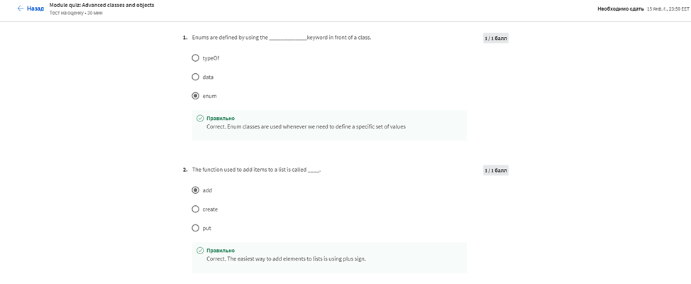
>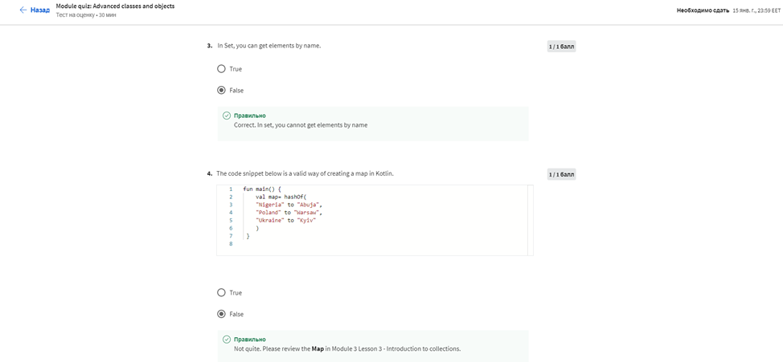
>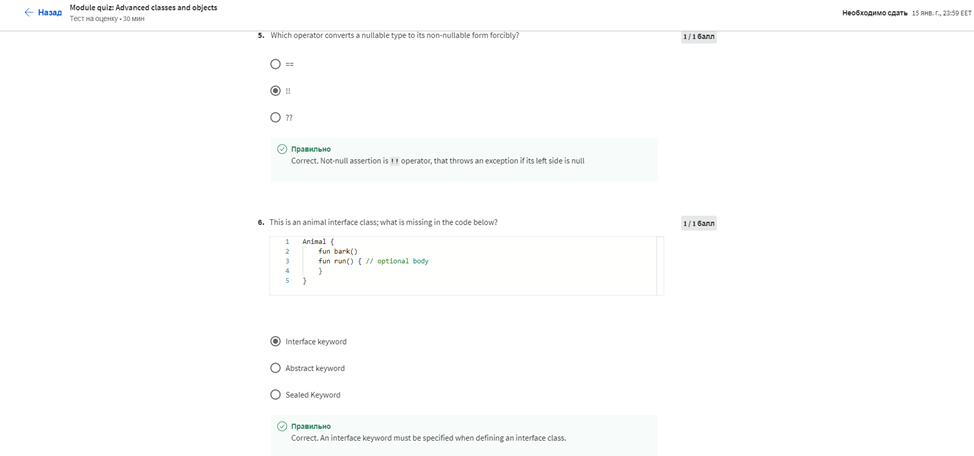
>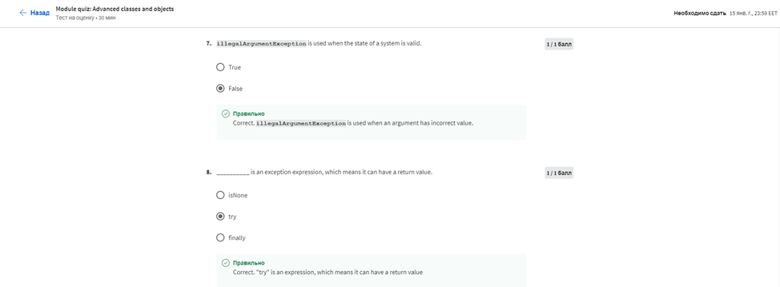
>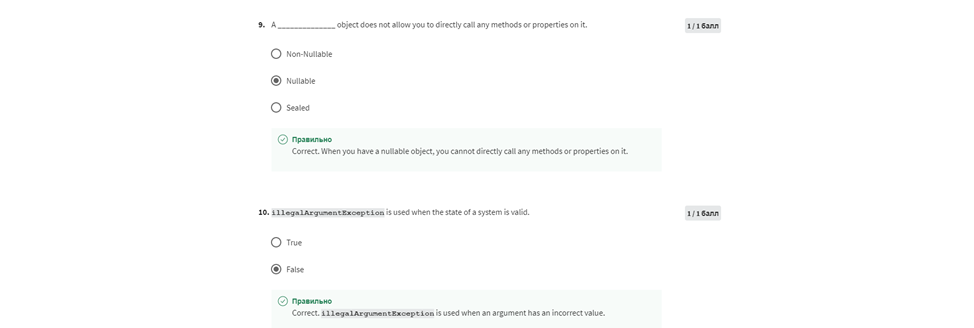

Результат:
>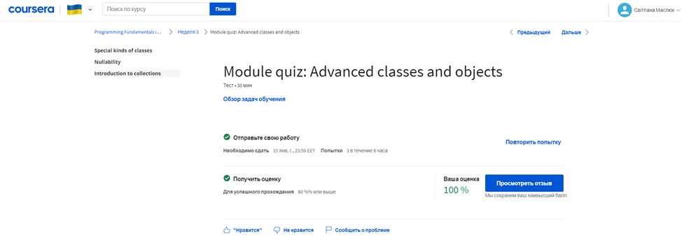

> Тиждень 4

Діальну оцінку
У цьому модулі ви дізнаєтеся про балове оцінювання. Після завершення розділів цього модуля ви синтезуєте навички, отримані під час курсу, щоб створити код для проекту «Банківський рахунок».

Було виконанно Module 4 Quiz:
>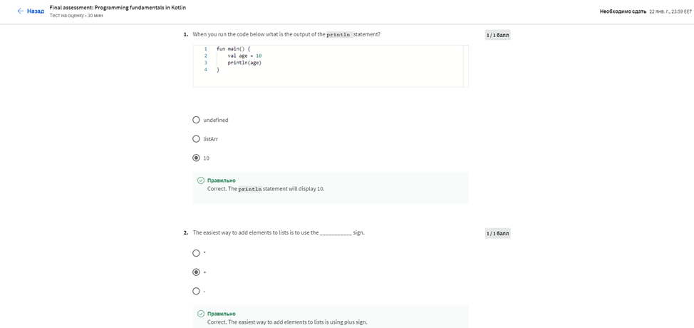
>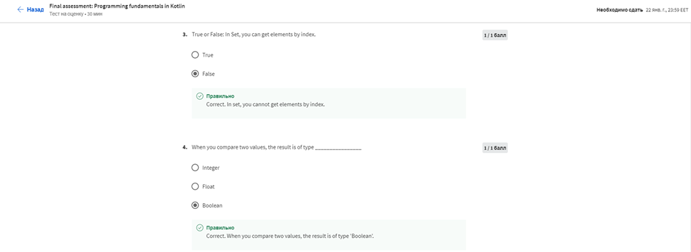
>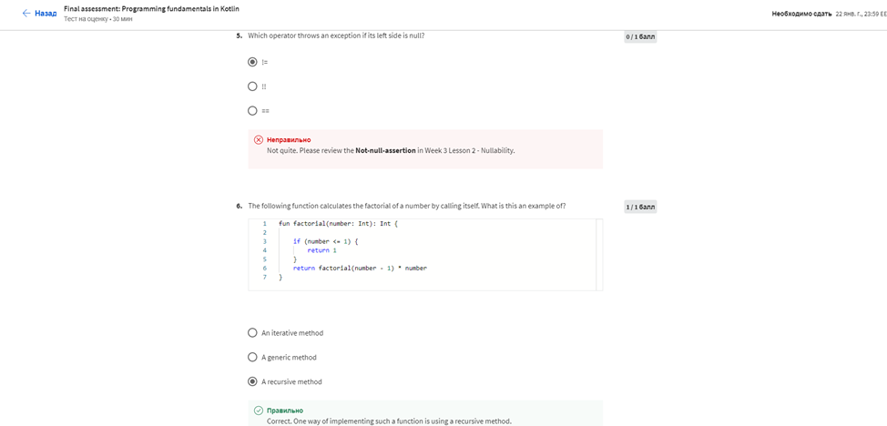
>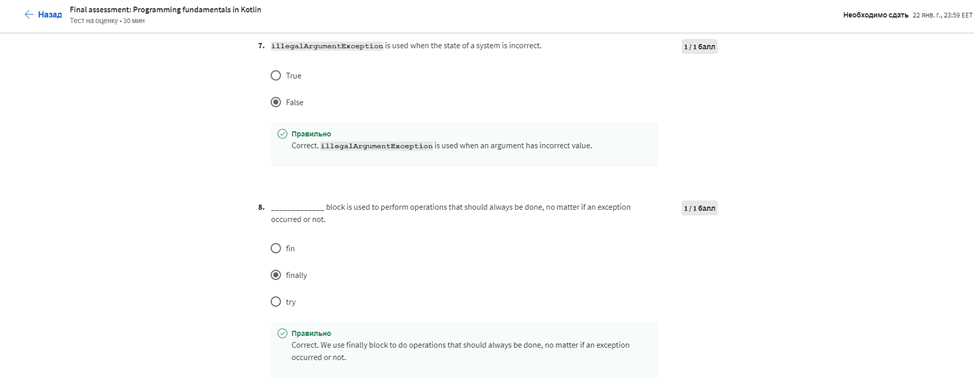
>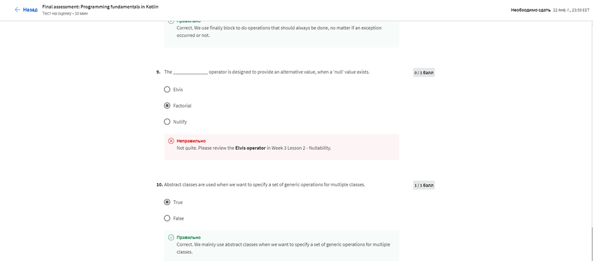

Результат:
>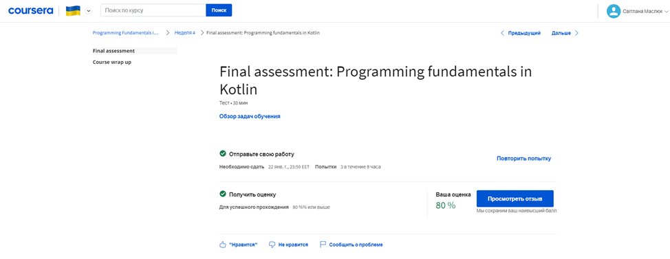

Сертефікат:
>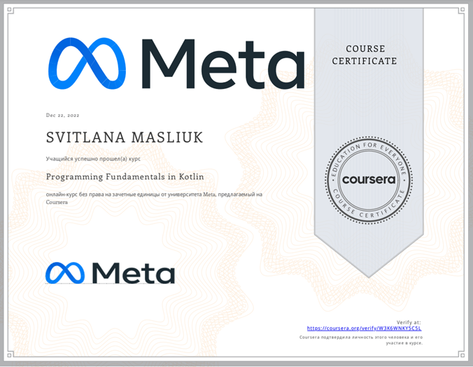
>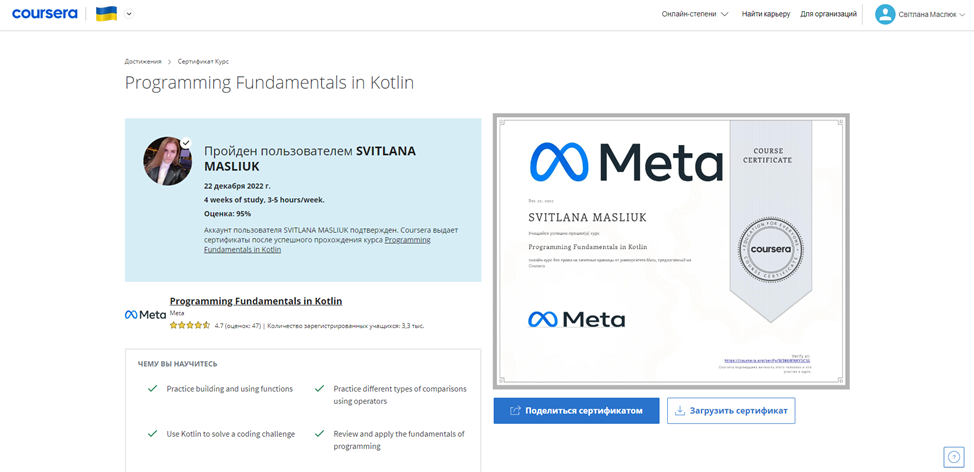
>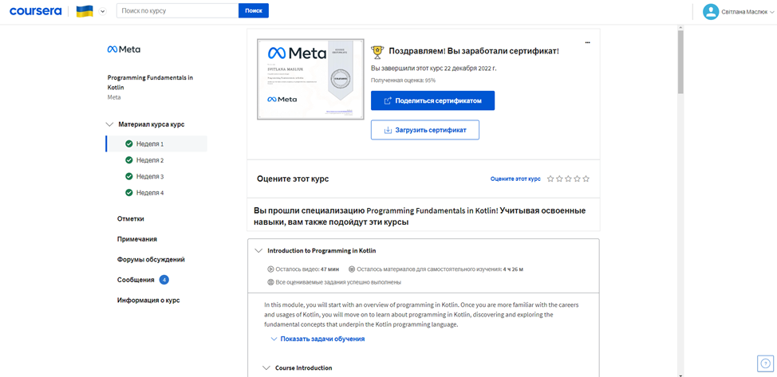

#### Висновок
Розширила свої знання основи програмування, які є основою будь-якої мови, а також унікальні аспекти синтаксису Kotlin.
